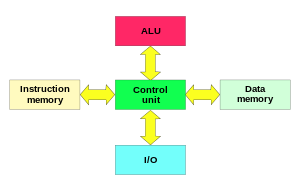

# **Podstawowe Koncepcje Architektoniczne**

**Podstawowe koncepcje architektoniczne (John Neumann, Architektura harwardzka)**

## **Architektura von Neumanna**

Rodzaj architektury komputera będąca implementacją koncepcji The Stored-Program gdzie dane przechowywane są wraz z kodem programu. Opracowana przez Johna von Neumanna, Johna W. Mauchly'ego oraz Johna Presper Eckerta w 1945 roku. Pierwszymi komputerami zbudowanymi w oparciu o tą architekturę były EDSAC oraz UNIVAC. Architektura ta jest podstawowym modelem dla większości współczesnych komputerów.

### **Opis architektury**

**W architekturze tej komputer składa się z czterech głównych komponentów:**

-   pamięci komputerowej przechowującej **dane programu** oraz **instrukcje programu**: każda komórka pamięci ma unikatowy identyfikator nazywany jej adresem.
-   jednostki sterującej odpowiedzialnej za pobieranie danych i instrukcji z pamięci oraz ich sekwencyjne przetwarzanie.
-   jednostki arytmetyczno-logicznej odpowiedzialnej za wykonanie podstawowych operacji arytmetycznych.
-   urządzeń wejścia/wyjścia służących do interakcji z operatorem.

**Schemat architektury von Neumanna**

**System komputerowy zbudowany w oparciu o architekturę von Neumanna powinien:**

-   mieć skończoną i funkcjonalnie pełną listę rozkazów.
-   mieć możliwość wprowadzania programu do systemu komputorowego poprzez urządzenia zewnętrzne i jego przechowywanie w pamięci w sposób indentyczny jak danych.
-   dane i instrukcje w takim systemie powinny być jednakowe dla procesora.
-   informacja jest tam przetwarzana dzięki sekwencyjnemu odczytywaniu instrukcji z pamięci komputera i wykonywaniu tych instrukcji w procesorze.

---

Podane warunki pozwalają przełączać system komputerowy z wykonania jednego zadania (programu) na inne bez fizycznej ingerencji w strukturę systemu, a tym samym gwarantują jego uniwersalność.

Sytem komputerowy von Neumanna nie posiada oddzielnych pamięci do przechowywania danych i instrukcji. Instrukcje jak i dane są zakodowane w postaci liczb. Bez analizy programu trudno jest określić czy dany obszar pamięci zawiera dane czy instrukcje. Wykonywany program może się sam modyfikować traktując obszar instrukcji jako dane, a po przetworzeniu tych instrukcji danych zacząć je wykonywać.

Model komputera wykorzystującego architekturę Neumanna jest często nazywany **maszyną czyfrową (PMC)**.

## **Architektura harwardzka**

Rodzaj architektury komputera. W odróżnieniu od architektóry von Neumanna, pamięć danych programu jest oddzielona od pamięci rozkazów.

Podstawowa architektura komputerów zerowej generacji i początkowa komputerów pierwszej generacji.

Równoległe przetwarzanie danych i instrukcji: W tym modelu, procesor ma zdolność do pobierania i przetwarzania danych oraz instrukcji jednocześnie, co potencjalnie zwiększa wydajność w porównaniu do architektury von Neumanna.

Zastosowania w specjalizowanych systemach: Architektura Harvardzka jest często wykorzystywana w specjalistycznych zastosowaniach, takich jak mikrokontrolery i układy wbudowane, gdzie równoległe przetwarzanie danych i instrukcji jest szczególnie ważne.

Różnice w złożoności sprzętowej: Ze względu na dodatkowe elementy jak osobna pamięć programu i pamięć danych, architektura Harvardzka może być bardziej złożona w implementacji niż tradycyjna architektura von Neumanna.

Prostsza (w stosunku do architektury von Neumanna) budowa przekłada się na większą szybkość działania, ten typ architektury jest wykorzystywany w procesach sygnałowych oraz przy dostępie procesora do pamięci cache.

Oddzielenie pamięci danych od pamięci rozkazów sprawia, że architektura harwardzka jest stosowana w **mikrokomputerach jednoukładowych**, w których dane programu są zapisane w nieulotnej pamięci ROM (EPROM/EEPROM), natomiast dla danych tymczasowych wykorzystana jest pamięć RAM (wewnętrzna lub zewnętrzna).

**Schemat architektury harwardzkiej**

---

### **Dodatkowe Informacje**

-   Harvard Architecture versus Von Neumann Architecture - https://www.youtube.com/watch?v=4nY7mNHLrLk
