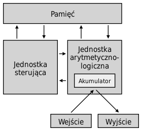

# **Podstawowe Koncepcje Architektoniczne**

## **Podstawowe koncepcje architektoniczne (John Neumann, Architektura harwardzka)**

**Architektura von Neumanna** - rodzaj architekury komputera będąca implementacją koncepcji The Stored-Program gdzie dane przechowywane są wraz z kodem programu. Opracowana przez Johna von Neumanna, Johna W. Mauchly'ego oraz Johna Presper Eckerta w 1945 roku. Pierwszymi komputerami zbudowanymi w oparciu o tą architektórę były EDSAC oraz UNIVAC.

