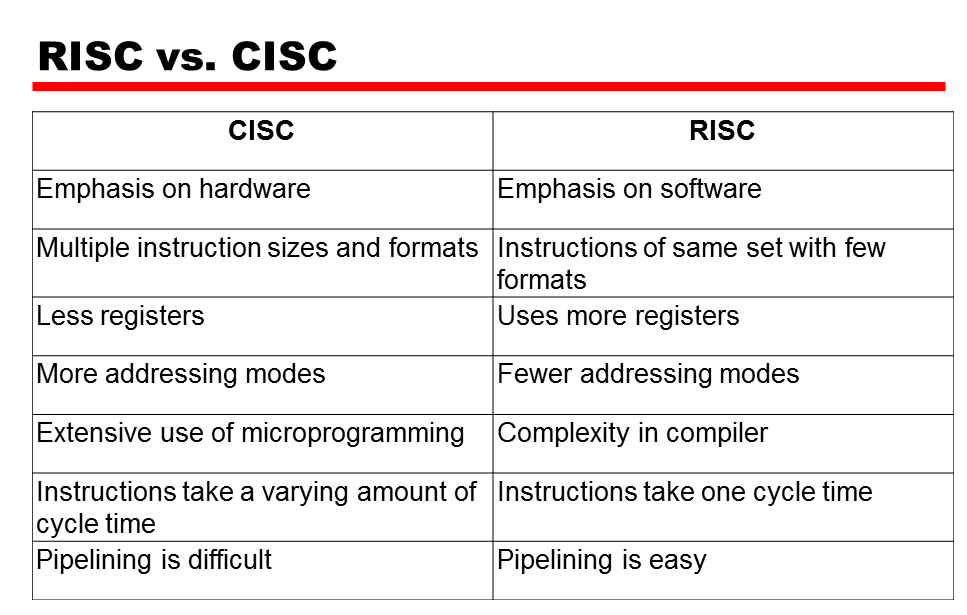

# **RISC & CISC**

**Zmajomość i rozróźnialność architektur typu RISC i CISC**

## **Architektura CISC**

**CISC** (ang. _Complex Instruction Set Computing_) - typ architektury zestawu instrukcji procesora o następujących cechach:

-   występowanie złożonych, specjalistycznych rozkazów (instrukcji), które do wykonania wymagają od kilku do kilkunastu cykli zegara,
-   szeroka gama trybów adresowania,
-   **przeciwnie niż w architekturze RISC rozkazy mogą operować bezpośrednio na pamięci (zamiast przesłania wartości do rejestrów i operowania na nich)**,
-   powyższe założenia powodują, iż dekoder rozkazów jest skomplikowany,

### **Istota Architektury CISC**

Istotą architektury CISC jest to, iż pojedynczy rozkaz mikroprocesora wykonuje kilka operacji niskiego poziomu, jak na przykład pobieranie z pamięci, operację arytmetyczną i zapisanie do pamięci.

Przed powstaniem procesorów RISC wielu komputerowych architektów probowało zmostkować lukę semantyczną - aby zaprojektować zestawy rozkazów, które wspierałyby języki programowania wysokiego poziomu przez dostarczenie rozkazów wysokiego poziomu np. wywołania funkcji i zwrócenia jej wartości, instrukcje pętli czy kompleksowe tryby adresowania. Rezultatem tego były programy o mniejszym rozmaiarze i z mniejszą ilością odwołań do pamięci, co w tamtym czasie było istotne z punktu widzenia wydajności przy jednoczesnym dążeniu do obniżenia kosztów pojedynczego komputera.

Przykłady rodzin procesorów o architekturze CISC to:

-   x86
-   IBM System/360
-   VAX
-   PDP-11

Współczesne procesory zgodne z x86 produkowane przez firmy Intel, AMD, i VIA przetwarzają rozkazy procesora x86 na proste mikropolecenia pracujące według idei RISC, często wykonujące się równolegle.

## **Architektura RISC**

**RISC** (ang. _Reduced Instruction Set Computing_) - typ architektury zestawu instrukcji procesora, który został przedstwaiony pod koniec lat 70. w teoretycznych pracach na uniwersytecie Berkeley oraz w wynikach badań Johna Cocke z Thomas J. Watson Reserch Center.

Ówczesne procesory (budowane w architekturze CISC) charakteryzowały się bardzo rozbudowaną listą rozkazów, ale - jak wykazały badania - statystycznie tylko nieliczna ich część była wykorzystywana w programie. Okazało się na przykład, że ponad 50% rozkazów w kodzie to zwykłe przypisania, tj. zapis zawartości rejestru do pamięci i odwrotnie.

Ponadto badania wykazały, że podczas działania programu ok. 26-45% wykonywanych instrukcji to instrukcje wywołania podprogramów lub instrukcje obsługujące pętlę, ok. 13-15% to wspomniane przypisania, 7-21% to instrukcje warunkowe, natomiast reszta to tylko 1-3%.

### **Istota Architektury RISC**

-   liczba rozkazów zredukowana do niezbędnego minimum. Wynosi ona kilkadziesiąt, podczas gdy w procecorach CISC sięga setek. Upraszcza to znacznie dekoder rozkazów,

-   redukcja trybów adresowania, dzięki czemu kody rozkazów są prostrze, bardziej zunifikowane, co dodatkowo upraszcza wspomniany wcześniej dekoder rozkazów. Ponadto wprowadzono tryb adresowania, który ogranicza liczbę przesłań,

-   Ograniczenie komunikacji pomiędzy pamięcią a procesorem. Przede wszystkim do przesyłania danych pomiędzy pamięcią a rejestrami służą dedykowane instrukcje, które zwykle nazywają się **load** (załaduj z pamięci) oraz **store** (zapisz do pamięci); pozostałe instrukcje moga operować wyłącznie na rejestrach. Schemat działania na liczbach znajdujących się w pamięci jest następujący: załaduj daną z pamięci do rejestru, na zawartośi rejestru wykonaj działanie, przypisz wynik z rejestru do pamięci,

-   zwiększenie liczby rejestrów (np. 32, 192, 256, podczas gdy np. w architekturze x86 jest zaledwie 8 rejestrów), co również ma wpływ na zmniejszenie liczny odwołań do pamięci.

---

**Zestawienie Architektur Procesorów RISC i CISC**

### **Dodatkowe Informacje**

Pierwszym procesorem zaprojektowanym w oparciu o architekturę RISC był RCA 1802 wyprodukowany przez firmę RCA.

Obecnie popularne procesory Intel, AMD, i VIA z punktu widzenia programisty są widziane jako CISC, ale ich rdzeń jest RISC-owy. Rozkazy CISC są rozbijane na **mikrorozkazy**, które są następnie wykonywane przez RISC-owy blok wykonawczy. W praktyceokazuje się, że rozwiązanie takie (pomimo wielu znaczących wad) jest podejściem znacznie bardziej wydajnym (szczególnie że RISC-owy blok wykonawczy jest znacznie bardziej nowoczesny od architektury CISC widocznej dla programisty).

Przykłady rodzin procesorów o architekturze RISC to:

-   ARM
-   Alpha
-   AMD 29000
-   IBM 801

---

-   RISC vs CISC - Is it Still a Thing? - https://www.youtube.com/watch?v=g16wZWKcao4
