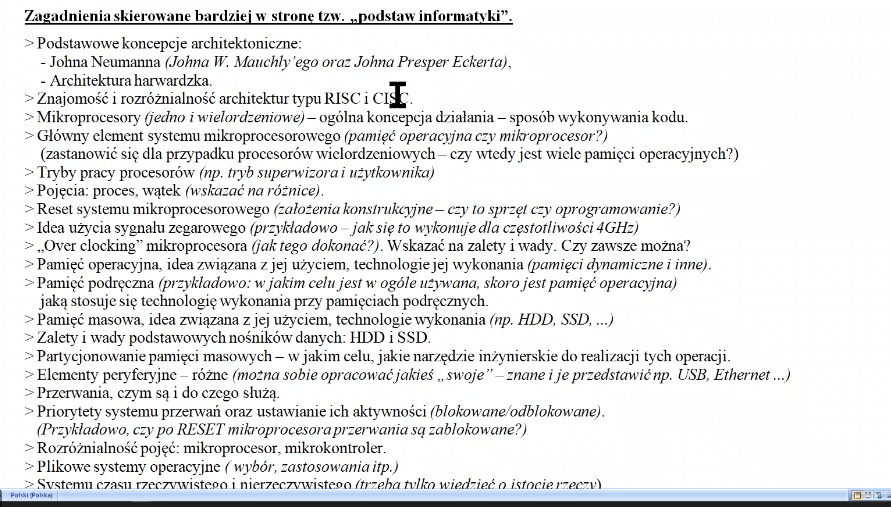
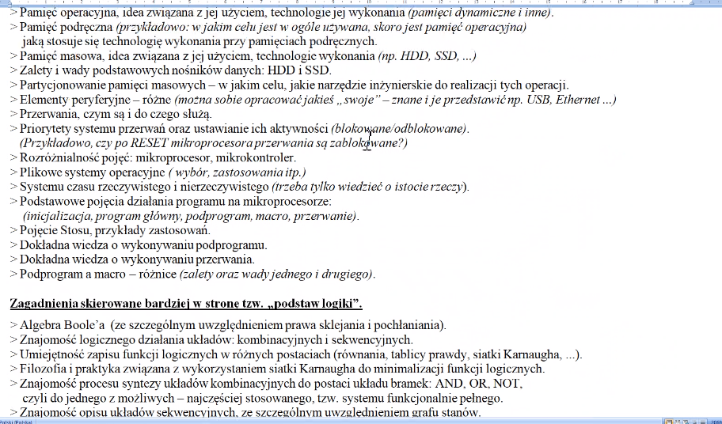
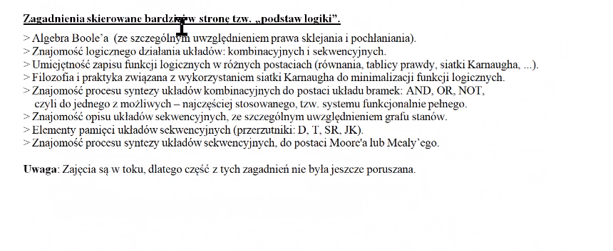

# **Lista Zagadnień**

## **Podstawy Informatyki**

-   [x] Podstawowe koncepcje architektoniczne (John Neumann, Architektura harwardzka).
-   [x] Znajomość i rozróżnialność architektur typu RISC i CISC.
-   [x] Mikroprocesory (jedno i wielordzeniowe) - ogólna koncepcja działania - sposób wykonywania kodu.
-   [x] Główny element systemu mikroprocesorowego (pamięć operacyjna czy mikroprocesor? Zastanowić się dla przypadku procesorów wielordzeniowych - czy wtedy jest wiele pamięci operacyjnych?).
-   [x] Tryby pracy procesorów (np. tryb superwizora i użytkownika).
-   [x] Pojęcia: proces, wątek (wskazać na różnice).
-   [x] Reset systemu mikroprocesorowego (założenia konstrukcyjne - czy to sprzęt czy oprogramowanie?).
-   [x] Idea użycia sygnału zegarowego (przykładowo jak się to wykonuje dla częstotliwości 4GHz).
-   [x] "Over clocking" mikroprocesora (jak tego dokonać). Wskazać na zalety i wady. Czy zawsze można?
-   [x] Pamięć operacyjna, idea związana z jej użyciem, technologie jej wykonania (pamięci dynamiczne i inne).
-   [x] Pamięć podręczna (przykładowo: w jakim celu jest w ogóle używana, skoro jest pamięć operacyjna) jaką stosuje się technologię wykonania przy pamięciach podręcznych.
-   [x] Pamięć masowa, idea związana z jej użyciem, technologie wykonania (np: HDD, SSD, ...).
-   [x] Zalety i wady podstawowych nośników danych: HDD i SSD.
-   [x] Partycjonowanie pamięci masowych - w jakim celu, jakie narzędzie inżynierskie do realizacji tych operacji.
-   [ ] Elementy peryferyjne - różne (można sobie opracować jakieś "swoje" - znane i je przedstawić np: USB, Ethernet...).
-   [ ] Przerwania, czym są i do czego służą.
-   [ ] Priorytety systemu przerwań oraz ustawianie ich aktywności (blokowanie/odblokowanie. Przykładowo, czy po RESET mikroprocesora przerwania są zablokowane?).
-   [ ] Rozróżnialność pojęć: mikroprocesor, mikrokontroler.
-   [ ] Plikowe systemy operacyjne (wybór, zastosowania itp.).
-   [ ] Systemy czasu rzeczywistego i nierzeczywistego (trzeba tylko wiedzieć o istioce rzeczy).
-   [ ] Podstawowe pojęcia działąnia programu na mikroprocesorze (inicjalizacja, program główny, podprogram, macro, przerwanie).
-   [ ] Pojęcie Stosu, przykłady zastosowań.
-   [ ] Dokładna wiedza o wykonaniu podprogramu.
-   [ ] Dokładna wiedza o wykonaniu przerwania.
-   [ ] Podprogram a macro - różnice (zalety oraz wady jednego i drugiego).

## **Podstawy Logiki**

-   [ ] Algebra Boole'a (ze szczególnym uwzględnieniem prawa sklejania i pochłaniania).
-   [ ] Znajomość logicznego działania układów: kombinacyjnych i sekwencyjnych.
-   [ ] Umijętność zapisu funkcji logicznych w różnych postaciach (równania, tablicy prawdy, siatki Karnaugha, ...).
-   [ ] Filozofia i praktyka związana z wykorzystaniem siatki Karnaugha do minimalizacji funkcji logicznych.
-   [ ] Znajomość procesu syntezy układów kombinacyjnych do postaci układu bramek: AND, OR, NOT, czyki do jednego z możliwych - najczęściej stosowanego, tzw. systemu funkcjonalnie pełnego.
-   [ ] Znajomość opisu układów sekwencyjnych, ze szczególnym uwzględnieniem grafu stanów.
-   [ ] Elementy pamięci układów sekwencyjnych (przerzutniki: D, T, SR, JK).
-   [ ] Znajomość procesu syntezy układów sekwencyjnych, do postaci Moore'a lub Mealy'ego.

---

