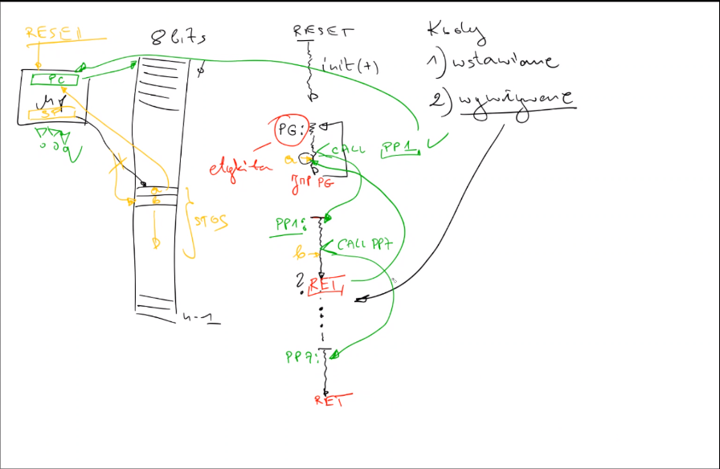
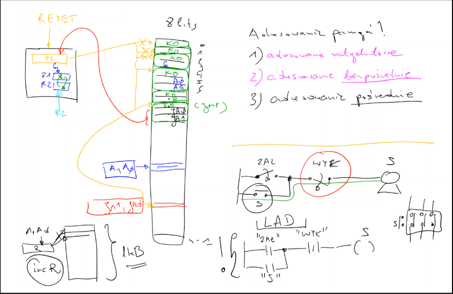

# **Podstawy logiki i informatyki 29.10**

**Kod wywoływanie**

## **Wykonywanie kody przez mikroprocesor**

Procesos program counter wskazuje po resecie na komurkę pamięci. Procesor bierze dane i je wykonuje. Niskopoziomowy kod. Proces ten może być symulowany programistyczne, jednak gdzieś na końcu hardware wykonuje pracę.

### **Adresowanie pamięci i wykonywanie kodu**

-   Pierwszy bajt jest nazywany kodem operacji
-   Propcesor posiada rejestry robocze
-   Rozkaz może zajmować dwa bajty a nie jeden, pierwszy bajt to wciąż kod operacji
-   W przypadku ośmiu bitów można zrealizować 256 operacji
-   Kolejna operacja może mieć 3 bajty jedbnak pierwszy to wciąż kod operacji.
-   Dane dostępne w kodzie operacji

### **Adresowanie Natychmiastowe**

Zaleta - szybkość działania
Wada - zapychanie pamięci programu

### **Adresowanie Bezpośrednie**

Podanie lokalizacji komórki pamięci
Zreowanie pamięci w danej komórce

W programowaniu niskopoziomowych nie ma zmiennych są rejestry adresy.

### **Adresowanie Pośrednie**

Pokazanie procesorowi gdzie jest adres w danym rejestrze
Adres w czymś do modyfikacji

### **W jaki sposób procesor realizuje skok - jump**

Jest to wykonanie rozkazu, załadowanie do prograsm counter nowej wartości. Nowy rozkaz z nowym kodem operacji.

Kolejniść wykonywania rozkazów, rozkazy ustawiają się jeden za drugim.

Jump skacze do adresu i zapomina gdzie był a call pamięta z jakiej pozycji zaczynał.

## **To Do**

-   [ ] Quantum Computers
-   [ ] Microcontrollers
-   [ ] Mikroprocesor
-   [ ] Kod wstawiany, kod wywoływany
-   [ ] **How programs work on low level**
-   [ ] **Jak działa procesor**
-   [ ] Program counter
-   [ ] Przerwania w mikroprocesorach i mikrokontrolerach
-   [ ] Wykonywanie kodu przez mikroprocesor
-   [ ] Program główny
